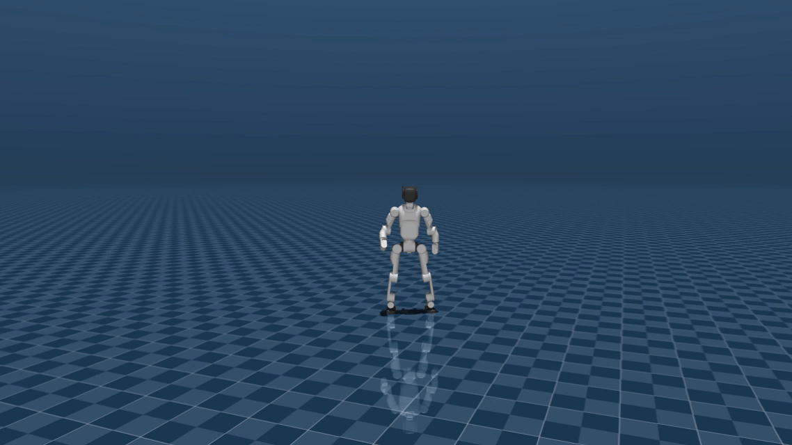

# DroidUp E1 mjlab

<p align="center"><a href="#中文">中文</a> | <a href="#english">English</a></p>

## Demo / 效果展示

### Sim2Sim

<table>
  <tr>
    <td align="center" width="50%">
      <br>
      <b>AMP — Walk &amp; Run / 行走与跑步</b>
    </td>
    <td align="center" width="50%">
      <br>
      <b>AMP — Turn, Lateral &amp; Backward / 转向、横移与后退</b>
    </td>
  </tr>
  <tr>
    <td align="center" width="50%">
      <br>
      <b>Mimic — MJ Dance / MJ 舞蹈</b>
    </td>
    <td align="center" width="50%">
      <br>
      <b>Mimic — Victory Dance / 胜利舞蹈</b>
    </td>
  </tr>
</table>

### Sim2Real

<table>
  <tr>
    <td align="center" width="50%">
      <br>
      <b>AMP — Walk &amp; Run / 行走与跑步</b>
    </td>
    <td align="center" width="50%">
      <br>
      <b>Mimic — Dance / 舞蹈</b>
    </td>
  </tr>
</table>

<a id="中文"></a>

## 中文

使用 MJLab 在仿真中训练 DroidUp E1 人形机器人运动策略，支持 AMP（Adversarial Motion Prior）和 Mimic 。

### 任务

| 任务 ID | 说明 |
| --- | --- |
| `Tracking-Flat-E1-21DOF` | E1 21-DOF 动作跟踪 |
| `Tracking-Flat-E1-21DOF-No-State-Estimation` | 使用重力投影的动作跟踪 |
| `AMP-Walk-Run-E1-21DOF` | 速度指令站立、行走、跑步、转向和横移 AMP |

### 安装

```bash
cd /home/saw/E1/DroidUpE1_mjlab
uv sync
source .venv/bin/activate
```

激活环境后可以直接使用 `python`，不需要 `uv run`：

```bash
python scripts/list_envs.py
```

训练日志使用 TensorBoard：`tensorboard --logdir logs/rsl_rl`。本地 `rsl_rl/` 以 editable 方式安装，版本为 `5.4.2`。

### 训练 AMP

```bash
python scripts/train.py AMP-Walk-Run-E1-21DOF \
  --env.scene.num-envs 4096 --gpu-ids '[0]'
```

默认专家数据位于 `dataset/e1_21dof/amp/`，包含站立、行走、跑步、原地转向和横移数据。

从 checkpoint 继续训练：

```bash
python scripts/train.py AMP-Walk-Run-E1-21DOF \
  --agent.resume True --agent.load-run 2026-08-18_11-57-11 \
  --agent.load-checkpoint model_6000.pt --agent.max-iterations 50000 \
  --env.scene.num-envs 4096 --gpu-ids '[0]'
```

### Mimic 和 Play

```bash
python scripts/train.py Tracking-Flat-E1-21DOF-No-State-Estimation \
  --env.scene.num-envs 4096 --gpu-ids '[0]'

python scripts/play_mimic.py Tracking-Flat-E1-21DOF-No-State-Estimation \
  --checkpoint-file logs/rsl_rl/<experiment>/<run>/model_5000.pt \
  --motion-file dataset/e1_21dof/mimic/dance_npz/MJ_dance.npz \
  --num-envs 1 --device cuda:0 --viewer native
```

### MuJoCo sim2sim

```bash
python scripts/play_amp.py AMP-Walk-Run-E1-21DOF \
  --checkpoint-file logs/rsl_rl/e1_21dof_walk_run_amp/<run>/model_6000.pt \
  --lin-vel-x 0.5 --lin-vel-y 0.0 --ang-vel-z 0.0 \
  --num-envs 1 --device cuda:0 --viewer native

python sim2sim/sim2sim_e1_21dof_amp.py \
  --policy sim2sim/policy/amp/walk_run.onnx --keyboard

python sim2sim/sim2sim_e1_21dof_mimic.py \
  --policy sim2sim/policy/mimic/mj_dance.onnx

python sim2sim/sim2sim_e1_21dof_mimic.py \
  --policy sim2sim/policy/mimic/chain_turns_yawfix_50hz.onnx
```

Chain Turns 的 114 维观测和实机接口见
[Sim2Real 说明](docs/chain-turns-sim2real.md)。

键盘输入来自启动脚本的终端，不占用 MuJoCo viewer 快捷键。按键：`W/S` 前后，`A/D` 横移，`J/L` yaw，`R` 清零指令，`Q` 退出。两个 sim2sim 的状态日志使用单行刷新；可用 `--log-interval 1.0` 调整刷新间隔。

### 工具和目录

项目主要目录结构如下：

```text
DroidUpE1_mjlab/
├── dataset/
│   ├── e1_21dof/
│   │   ├── amp/                  # AMP专家动作数据
│   │   └── mimic/                # Mimic动作数据
│   └── mocap/                    # BVH动作捕捉数据
├── src/
│   ├── assets/e1_21dof/          # E1 XML、URDF和网格
│   └── tasks/
│       ├── amp/                  # AMP任务配置与实现
│       └── mimic/                # Mimic任务配置与实现
├── scripts/                      # 训练和播放入口
├── sim2sim/
│   ├── policy/amp/               # AMP ONNX策略
│   ├── policy/mimic/             # Mimic ONNX策略
│   └── sim2sim_*.py              # MuJoCo sim2sim程序
├── tools/                        # 数据转换和回放工具
├── docs/                         # 效果展示和文档资源
├── logs/                         # 训练日志与checkpoint
├── pyproject.toml
└── README.md
```

- `tools/amp/pkl_to_npz.py`：AMP PKL 转 XML 顺序 NPZ
- `tools/amp/replay_npz.py`：AMP 动作回放
- `tools/mimic/pkl_to_npz.py`：Mimic PKL 转 NPZ
- `tools/mimic/replay_npz.py`：Mimic 动作回放
- `src/assets/e1_21dof/`：E1 XML、URDF 和网格
- `src/tasks/mimic/`：Mimic 任务
- `src/tasks/amp/`：AMP 任务
- `dataset/e1_21dof/`：E1 AMP/Mimic 数据

所有数据和策略都使用 `E1_21dof.xml` 的 XML 关节顺序，不使用 Isaac Lab 排列。

### 参考项目

- [TienKung-Lab](https://github.com/Open-X-Humanoid/TienKung-Lab.git)
- [MJLab](https://github.com/mujocolab/mjlab.git)
- [AMP_mjlab](https://github.com/ccrpRepo/AMP_mjlab.git)

<p align="right"><a href="#english">English</a></p>

<a id="english"></a>

## English

Training DroidUp E1 humanoid robot locomotion using MJLab with AMP (Adversarial Motion Prior) and Mimic learning in simulation.

### Tasks

| Task ID | Description |
| --- | --- |
| `Tracking-Flat-E1-21DOF` | E1 21-DOF motion tracking |
| `Tracking-Flat-E1-21DOF-No-State-Estimation` | Motion tracking with projected gravity |
| `AMP-Walk-Run-E1-21DOF` | Velocity-commanded standing, walking, running, turning, and lateral AMP |

### Installation

```bash
cd /home/saw/E1/DroidUpE1_mjlab
uv sync
source .venv/bin/activate
```

After activation, commands can be run directly with Python. Training uses TensorBoard: `tensorboard --logdir logs/rsl_rl`. The local `rsl_rl/` checkout is installed editable at version `5.4.2`.

### Training, play, and sim2sim

```bash
python scripts/train.py AMP-Walk-Run-E1-21DOF \
  --env.scene.num-envs 4096 --gpu-ids '[0]'

python scripts/play_amp.py AMP-Walk-Run-E1-21DOF \
  --checkpoint-file logs/rsl_rl/e1_21dof_walk_run_amp/<run>/model_6000.pt \
  --lin-vel-x 0.5 --lin-vel-y 0.0 --ang-vel-z 0.0 \
  --num-envs 1 --device cuda:0 --viewer native

python scripts/train.py Tracking-Flat-E1-21DOF-No-State-Estimation \
  --env.scene.num-envs 4096 --gpu-ids '[0]'

python scripts/play_mimic.py Tracking-Flat-E1-21DOF-No-State-Estimation \
  --checkpoint-file logs/rsl_rl/<experiment>/<run>/model_5000.pt \
  --motion-file dataset/e1_21dof/mimic/dance_npz/MJ_dance.npz \
  --num-envs 1 --device cuda:0 --viewer native

python sim2sim/sim2sim_e1_21dof_amp.py \
  --policy sim2sim/policy/amp/walk_run.onnx --keyboard

python sim2sim/sim2sim_e1_21dof_mimic.py \
  --policy sim2sim/policy/mimic/mj_dance.onnx
```

Keyboard input is read from the launching terminal rather than the MuJoCo viewer: `W/S` forward/backward, `A/D` lateral, `J/L` yaw, `R` clear command, and `Q` quit. Both sim2sim runners refresh status on one terminal line; use `--log-interval 1.0` to change the interval.

### Tools and layout

The main project layout is:

```text
DroidUpE1_mjlab/
├── dataset/
│   ├── e1_21dof/amp/             # AMP expert motions
│   ├── e1_21dof/mimic/           # Mimic motions
│   └── mocap/                    # BVH motion-capture data
├── src/
│   ├── assets/e1_21dof/           # E1 XML, URDF, and meshes
│   └── tasks/                    # AMP and Mimic task implementations
├── scripts/                      # Training and play entry points
├── sim2sim/
│   ├── policy/amp/               # AMP ONNX policies
│   ├── policy/mimic/             # Mimic ONNX policies
│   └── sim2sim_*.py              # MuJoCo sim2sim runners
├── tools/                        # Dataset conversion and replay tools
├── docs/                         # Demo assets and documentation
├── logs/                         # Training logs and checkpoints
├── pyproject.toml
└── README.md
```

`tools/amp/pkl_to_npz.py` and `tools/mimic/pkl_to_npz.py` convert datasets. The matching `replay_npz.py` scripts replay them in MuJoCo. All datasets and policies use the exact joint order from `E1_21dof.xml`, not an Isaac Lab permutation.

- `src/assets/e1_21dof/`: E1 XML, URDF, and meshes
- `src/tasks/mimic/`: Mimic tasks
- `src/tasks/amp/`: AMP task
- `dataset/e1_21dof/`: E1 AMP/Mimic datasets
- `scripts/`: training and play entry points
- `sim2sim/`: MuJoCo ONNX runners

### References

- [TienKung-Lab](https://github.com/Open-X-Humanoid/TienKung-Lab.git)
- [MJLab](https://github.com/mujocolab/mjlab.git)
- [AMP_mjlab](https://github.com/ccrpRepo/AMP_mjlab.git)

<p align="right"><a href="#中文">中文</a></p>
